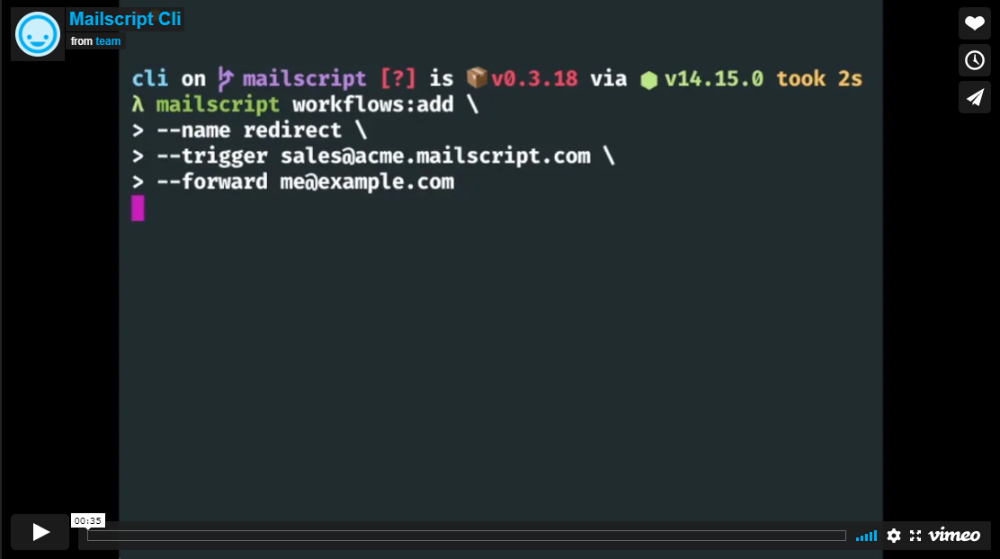

<p align="center">
  
</p>
<p align="center">
MailScript cli
<hr/>
</p>
<div align="center">

### Configure and use mailscript from the command-line

<hr/>

[](https://npmjs.org/package/mailscript)
[](https://npmjs.org/package/mailscript)
[](https://github.com/mailscript/mailscript/blob/master/package.json)
[](https://discord.gg/US24HAVYq2)


</div>

<p align="center">
  <a href="https://vimeo.com/489472356">
    
  </a>
<p>

# Table of Contents
<!-- toc -->
* [Features](#features)
* [Getting started](#getting-started)
* [Usage](#usage)
* [Commands](#commands)
* [Development](#development)
* [Publish](#publish)
* [License](#license)

# Features
* TBD

## Getting Started
* Read the [docs](https://docs.mailscript.com/)
* Take a look at the [HTTP API docs](https://api.mailscript.com/)

<!-- tocstop -->
## Usage
<!-- usage -->
### Install through npm
In order to use the mailscript CLI must first install it wth the global flag. Run the following...
```sh-session
$ npm install -g mailscript
```
Or you could install dev version (Not recommended)
```sh-session
$ npm install -g https://github.com/mailscript/cli.git
```
**Basic usage**
```
**Login local daemon**
```sh-session
$ mailscript login
... You should see a browser window open prompting you to login to your mailscript account. The daemon will handle the rest upon completion
```
<!-- usagestop -->
# Commands
Ready to dive into mailscript? [Read the commandline documentation](https://github.com/mailscript/cli/tree/main/docs)
<!-- commands -->

# Development

In development a `.env` file is used:
****
```shell
MAILSCRIPT_CONFIG_PATH=.mailscript-test # path to use for .mailscript config file
MAILSCRIPT_LOGIN_URL=http://localhost:3000 # login website url
MAILSCRIPT_API_SERVER=http://localhost:7000/v2 # api server url
MAILSCRIPT_EMAIL_DOMAIN=mailscript.io # the domain to use when assign email addresses
MAILSCRIPT_DAEMON_BRIDGE_URL=ws://localhost:8888 # the daemon bridge service
```

To run a command:

```shell
nvm use
node bin/run version
```

# Publish

Publishing the cli is a manual process.

First check that the cli passes tests and linting:

```shell
y format:check
y test
```

To publish, ensure you are on `main`. Then you will need the `team@mailscript` login to npm to publish:

```shell
npm login
npm version patch # or major or minor
git push
npm publish
```

# License
CLI license: [MIT](https://github.com/mailscript/cli/blob/main/LICENSE)