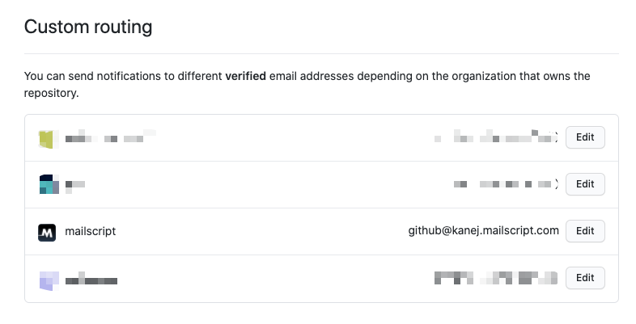

# Mailscript templates: GitHub action failure to notification

You can use this template to trigger OS level notifications whenever a GitHub action run fails.

In this template we will achieve this by redirecting github emails through a mailscript email address (or the subset related to a particular github org), then setting a workflow that forwards from that address to a mailscript daemon running on your local machine. The daemon will run a `node.js` script that bridges to the OS for notifications.

## Preparation

This template assumes you have `node.js v14` or higher installed.

Ensure you have the latest version of the mailscript cli:

```sh
npm install -g mailscript
```

Clone this repo locally and `cd` into its root. Install the node dependencies with:

```sh
npm install
```

Mailscript configuration can be setup on the command line or by importing from a yaml file.
Both are detailed bellow.

## Setup from Yaml

This repo includes a `./config.yml` file that on import will:

* Setup a github specific email address under your domain `github@$username.mailscript.com` e.g. `github@smith.mailscript.com`
* Setup a trigger that will filter out emails that are not Github Action run failures, by setting a rule that based on the metadata that Mailscript adds to github emails.
* Setup two actions
  * One to forward to the email address you used to sign up to Mailscript
  * One to send an email to a Mailscript daemon running on your local machine - the daemon will identify itself as `mylaptop`
* Finally two workflows are setup:
  * One to forward all emails coming into the `github@$username.mailscript.com` address onto you signup account email address
  * One to forward Github Action run fail emails to the Mailscript daemon running on your local machine

The yaml file includes two mailscript specific variables: `$username` and `$account-email-address`. On import the cli will substitute the `username` associated
with your account, and for `$account-email-address` it will use the email address
used to signup to mailscript.

To import a mailscript yaml file:

```sh
mailscript sync:import --path ./config.yml
```

The config.yml is included here inline for convenience.

```yml
version: '0.2'
addresses:
  github@$username.mailscript.com:
    keys:
      - name: owner
        read: true
        write: true
triggers:
  - name: github-action-failed
    composition:
      - criteria:
          github.pr.buildFailed: true
actions:
  - name: mylaptop
    type: daemon
    config:
      daemon: mylaptop
  - name: forward-to-personal-email
    type: mailscript-email
    config:
      key: owner
      from: github@$username.mailscript.com
      forward: $account-email-address
      type: forward
workflows:
  - name: forward-github-to-personal
    input: github@$username.mailscript.com
    action: forward-to-personal-email
  - name: github-action-failures-to-daemon
    input: github@$username.mailscript.com
    trigger: github-action-failed-trigger
    action: mylaptop
```

## Manual setup

Each of the elements in the config.yml above can be created with individual commands
at the command line.

First, setup a new mailscript address specifically for dealing with github emails (replacing `<username>` text with your mailscript username):

```sh
mailscript addresses:add --address github@<username>.mailscript.com
```

Setup a trigger that will filter out emails that are not Github Action Run failed emails:

```sh
mailscript triggers:add \
  --name github-action-failed \
  --property github.pr.buildFailed \
  --equals true
```

Configure two actions, one to forward to your preferred email address, the other to send
emails to a named mailscript daemon (i.e. `mylaptop`) that can be run on your local machine (replace `<username>` and `<preferred-email-address>`):

```sh
mailscript actions:add \
  --name mylaptop \
  --daemon mylaptop

mailscript actions:add \
  --name forward-to-personal-email \
  --forward <preferred-email-address> \
  --from github@<username>.mailscript.com
```

Setup a workflow that will use the existing `forward-github-to-personal` action to redirect all emails coming into `github@<username>.mailscript.com` to your preferred
email address, this will allow us to verify the mailscript address on GitHub (replace `<username>`):

```sh
mailscript workflows:add \
  --name forward-github-to-personal \
  --input github@<username>.mailscript.com \
  --action forward-to-personal-email
```

Create a workflow for send `Github Action run failed` emails to a named daemon to be run
on your local machine:

```sh
mailscript workflows:add \
  --name github-action-failures-to-daemon \
  --input github@<username>.mailscript.com \
  --trigger github-action-failed \
  --action mylaptop
```

Setup a workflow that waits for PR failed emails:

## Setup on Github

To send Github emails via mailscript before being forwarded on to your preferred
email address, we configure the `github@<username>.mailscript.com` as an allowed
email in GitHub.

After logging into GitHub, navigate to the email settings page:

https://github.com/settings/emails

Add the mailscript email address `github@<username>.mailscript.com` as an allowed github email via `Add email address`:


Github will send a verification email to the `github@<username>.mailscript.com`, this will be forwarded on to your preferred email address as defined
in the workflow `forward-github-to-personal`.

Verify the sent email.

Once verified you can use `github@<username>.mailscript.com` for some or all of your github notifications. This is done under the `Notificaitons` tab:

https://github.com/settings/notifications

At the bottom of the page is the `Custom routing` section. You can choose which organizations to redirect via the mailscript address:



Once redirected the two workflows will kick in forwarding the github emails
to your preferred account but directing build failures to your local daemon.

## Setup the local daemon

Run a local daemon using the daemon named in the workflow (i.e. `mylaptop`) that triggers the `notify.js` script whenever a `Github Action run failed` email is received:

```sh
mailscript daemon --daemon mylaptop --command "node ./notify.js"
```

The contents of the emails is passed to the script as stringified json within the environment variable `payload`.
